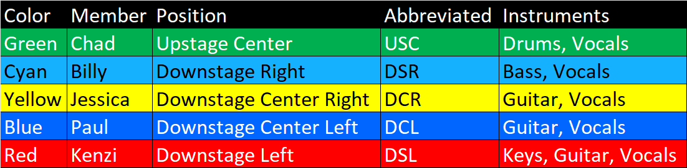

<!-- title: The Perfect Strangers - Technical Documentation -->
# Technical Documentation <!-- omit from toc -->

     

All technical documentation related to band, [The Perfect Strangers](https://ThePerfectStrangers.band).

- [Rider](#rider)
- [Document Style](#document-style)
- [Stage Diagram](#stage-diagram)
  - [Full Band](#full-band)
- [Input List](#input-list)
  - [Full Band](#full-band-1)
    - [Input + Equipment](#input--equipment)
    - [Split](#split)
    - [Wireless Operating Frequencies](#wireless-operating-frequencies)
  - [Acoustic](#acoustic)
    - [Input + Equipment](#input--equipment-1)

# Rider

The band uses a rider to ensure the safety of the the public, band members, and their equipment.

# Document Style

The graphics in this repository use the following color convention for the band members:

# Stage Diagram

These are diagrams relating to the configuration and placement of people and/or equipment on stage.

## Full Band

This is the general layout of the band. It includes the people, microphones, equipment, cable routes, where power is needed, mixing equipment, and speaker placement.

**Note:**  In a situation where the band is not in charge of the PA, the speakers on the left and right sides of the stage should be omitted from consideration.

# Input List

This is a list of inputs needed by the band. It includes:
  * The input description
  * Type of equipment (such as microphone)
  * If 48V Phantom Power is required
  * Other notes related to the input channel

48V phantom power and gain control are managed on stage by the band's IEM mixing rig. A split is used to send a line-level signal to FOH. More information can be found below regarding the split.

## Full Band

### Input + Equipment

### Split

**Note:** All outputs are set as `Input/LC` from the band's mixer. You can find out more details regarding the split labels on the Split Map:

### Wireless Operating Frequencies

The band uses multiple devices that operate wirelessly. These devices, along with their operating frequencies, are listed here:

| Device                    | Model         | Location | Operating Frequencies |
|---------------------------|---------------|----------|-----------------------|
| Chad's IEM transmitter    | Shure PSM 200 | IEM Box  |  518 - 554 MHz        |
| Paul's IEM transmitter    | Shure PSM 200 | IEM Box  |  518 - 554 MHz        |
| Jessica's IEM transmitter | Shure PSM 200 | IEM Box  |  518 - 554 MHz        |
| Kenzi's IEM transmitter   | Shure PSM 300 | IEM Box  | 488–937.5 MHz         |
| John's IEM transmitter    | Xvive U4      | IEM Box  | 2.4 Ghz               |

## Acoustic

The band can perform in smaller venues with an acoustic set up. This setup replaces the full drum set with a smaller percussion setup, removes the need for IEMs and the IEM box, and shrinks the overall stage footprint.

### Input + Equipment

