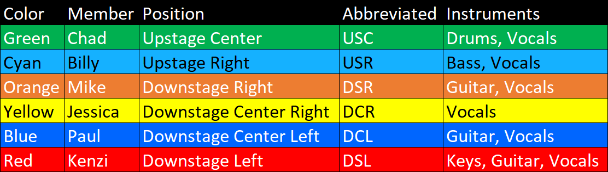
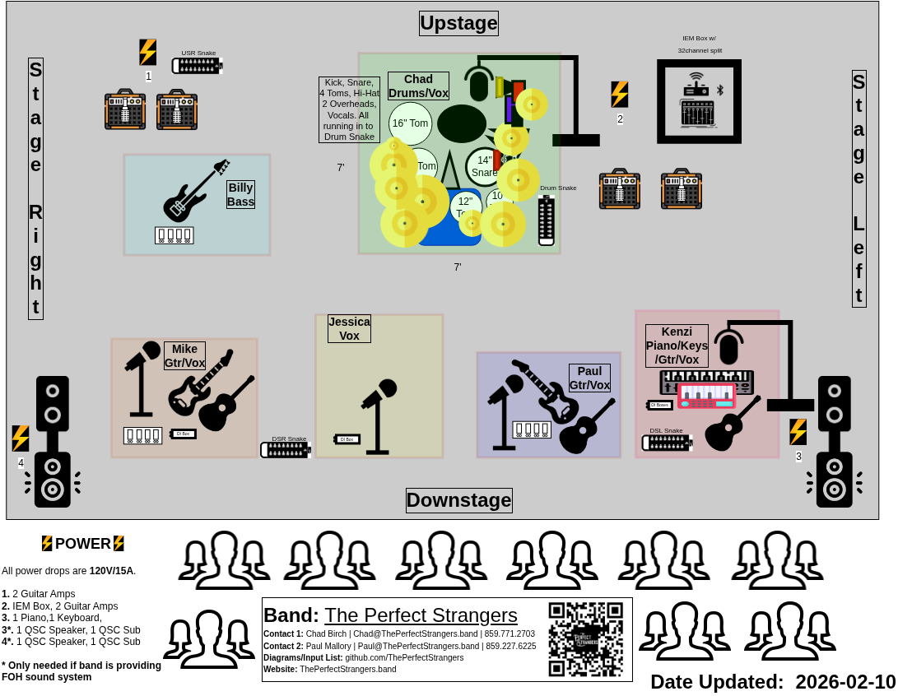

  

<!-- title: The Perfect Strangers - Technical Documentation -->
# Technical Documentation <!-- omit from toc -->

     

All technical documentation related to band, [The Perfect Strangers](https://ThePerfectStrangers.band).

- [Complete Technical Documentation](#complete-technical-documentation)
- [Rider](#rider)
- [Document Style](#document-style)
- [Stage Diagram](#stage-diagram)
  - [Full Band](#full-band)
- [Input List](#input-list)
  - [Full Band](#full-band-1)
    - [Input + Equipment](#input--equipment)
    - [Split](#split)
      - [Modes](#modes)
      - [Splitter Assignments](#splitter-assignments)
        - [Order \& Ports](#order--ports)
        - [Snake Tails](#snake-tails)
    - [Mixer Configuration](#mixer-configuration)
  - [Acoustic](#acoustic)
    - [Input + Equipment](#input--equipment-1)
- [Repository Health](#repository-health)

# Complete Technical Documentation

For a complete PDF that includes the Rider, Stage Diagram, and Input List, click the link below:

# Rider

The band uses a rider to ensure the safety of the the public, band members, and their equipment.

# Document Style

The graphics in this repository use the following color convention for the band members:

# Stage Diagram

These are diagrams relating to the configuration and placement of people and/or equipment on stage.

## Full Band

This is the general layout of the band. It includes the people, microphones, equipment, cable routes, where power is needed, mixing equipment, and speaker placement.

**Note:** The band's `IEM Box` and `Bass` player may be swapped if the stage access poses problems in the default configuration.

**Note:**  In a situation where the band is not in charge of the PA, the PA speakers located Downstage Right and Downstage Left should be omitted from consideration.

[Click here](StageDiagram/FullBand/StageAssembly/README.md) to access the step-by-step stage assembly guide.

# Input List

This is a list of inputs needed by the band. It includes:
  * The input description
  * Type of equipment (such as microphone)
  * If 48V Phantom Power is required
  * Other notes related to the input channel

More information regarding splitting the signal to front-of-house (FOH) can be found in the [Split section](#split).

## Full Band

### Input + Equipment

### Split

#### Modes

The band requires a 24-channel split. The band can provide 10 feet of labeled split tails (XLR) from the band's IEM box if needed.

When splitting is required, we can support two modes:
1. (Preferred) The band uses their own microphones, running them into their IEM Mixer. Then a split signal is sent to the front-of-house (FOH). The band will manage all phantom power to mics and control all gain (staged to `-18.5`). The band then manages their own IEM mixes, leaving the FOH engineer to only manage the FOH mix. This is preferred because it reduces the amount of time each band member must spend recalibrating their mix.

2. (Festival) All microphones and cabling are provided by a live sound team, who manage both FOH sound and individual mixing for each band member. The band would bring their own earbuds to connect to IEM body packs provided by the sound team. Alternatively, the band may provide IEM transmitters and body packs if needed, but they will need to be routed from the monitor mixing board on-stage.

#### Splitter Assignments

All ports are XLR male.

##### Order & Ports

The splitter ports are ordered as follows:
1. **Drums**: 1-10
2. **Bass**: 13
3. **Piano/Keyboards**: 15-16
4. **Guitars**: 17-22
    * (E): Electric
    * (A): Acoustic
6. **Vocals**: 25-30
    * `Vocals 6` may not be required for every show as it is for guest vocalists.

##### Snake Tails

A 10 ft. snake cable may be utilized from the IEM Mixer to handle connections at a distance. There are four 8-channel snake cables that are color sequenced by banding on the cable: Green, Blue, Red, and Yellow. The `Split Map` is broken down into four groups containing eight channels across three distinct rows. The top row if the group specifies the banded cable to use. The second row identifies the color sequence for the non-labeled connecting end of the snake cable which should be color-matched to the numbered port assignment. Finally, the third row specifies the generic input description by location, matching the performer using the [Document Style](#document-style) outlined at the beginning. Meaning you find the cable banded in green, the plug each non-labeled end to the port corresponding to the color of the cable, then the labled end can connect to the patch routed to the front-of-house (FOH) engineer.

**Note:** All outputs are set as [Line-Level](https://drewbrashler.com/2026/behringer-wing-stageconnect-guide/) from the band's mixer. You can find out more details regarding the split labels on the Split Map:

### Mixer Configuration

The band uses a Behringer WING RACK mixer for mixing all IEMs and front-of-house when necessary. If you will be working with the band to manage live sound at an event using their equipment, you can download the latest configuration from the [Mixer folder](Mixer).

You can view the mixer configuration by using the WING EDIT software provided by Behringer. You can [download it from their website](https://www.behringer.com/wing/wing-rack#documentations).

## Acoustic

The band can perform in smaller venues with an acoustic set up. This setup replaces the full drum set with a smaller percussion setup, removes the need for IEMs and the IEM box, and shrinks the overall stage footprint. This configuration differs per show as it aligns more closely with the set list. For any documentation or requirements, please contact the band directly at [technical@theperfectstrangers.band](mailto:technical@theperfectstrangers.band?subject=Acoustic%20Set%20Up%20for%20The%20Perfect%20Strangers).

### Input + Equipment

# Repository Health

This is the status of the backing workflows that automate the creation of repository artifacts, such as PDFs and images. If any of these are failing, then their related artifacts may be out-of-date.

