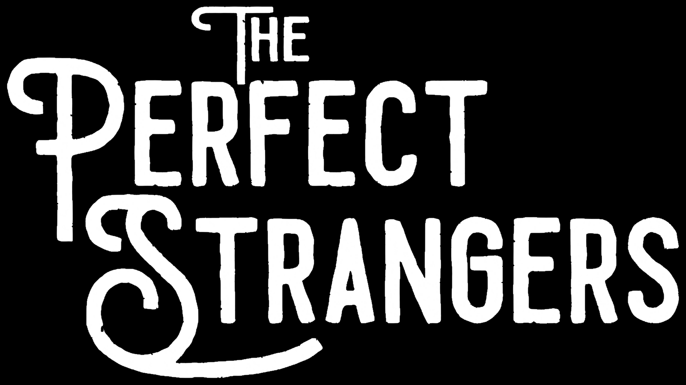

  

<!-- title: The Perfect Strangers - Technical Documentation -->
# Technical Documentation <!-- omit from toc -->

     

All technical documentation related to band, [The Perfect Strangers](https://ThePerfectStrangers.band).

- [Rider](#rider)
- [Stage Assembly](#stage-assembly)
- [Repository Health](#repository-health)

# Rider

The band uses a rider to ensure the safety of the the public, band members, and their equipment. The rider includes:
* Information about the band
* Both technical and non-technical requirements
* Stage diagram (stage plot)
* Input List
* Cancellation Policy

# Stage Assembly

A step-by-step guide on [how the band assembles the stage](./StageDiagram/FullBand/StageAssembly/README.md).

# Repository Health

This is the status of the backing workflows that automate the creation of repository artifacts, such as PDFs and images. If any of these are failing, then their related artifacts may be out-of-date.

