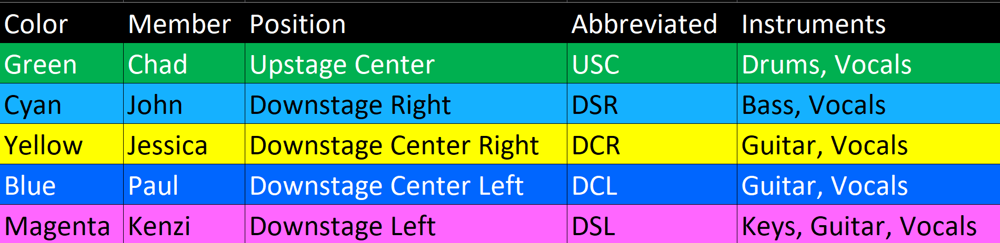

<!-- title: The Perfect Strangers - Technical Documentation -->
# Technical Documentation <!-- omit from toc -->

     

All technical documentation related to band, [The Perfect Strangers](https://ThePerfectStrangers.band).

- [Document Style](#document-style)
- [Rider](#rider)
- [Stage Diagram](#stage-diagram)
  - [Full Band](#full-band)
- [Input List](#input-list)
  - [Full Band](#full-band-1)
    - [Input + Equipment](#input--equipment)
    - [Snake, PA, and Split](#snake-pa-and-split)
  - [Acoustic](#acoustic)
    - [Input + Equipment](#input--equipment-1)
    - [Snake, PA, and Split](#snake-pa-and-split-1)

# Document Style

The graphics in this repository use the following color convention for the band members:

# Rider

The band uses a simple rider to ensure the safety of the band members and their equipment. [Click here to view the band Rider](Rider.md).

# Stage Diagram

These are diagrams relating to the configuration and placement of people and/or equipment on stage.

## Full Band

This is the general layout of the band. It includes the people, microphones, equipment, cable routes, where power is needed, mixing equipment, and speaker placement.

**Note:**  In a situation where the band is not in charge of the PA, the speakers on the left and right sides of the stage should be omitted from consideration.

[Click here to download the Stage Diagram as a PDF.](Stage%20Diagram/Full%20Band/Stage%20Diagram.drawio.pdf)

# Input List

This is a list of inputs needed by the band. It includes:
  * The input description
  * Type of equipment (such as microphone)
  * If 48V Phantom Power is required
  * Other notes related to the input channel

48V phantom power and gain control are managed on stage by the band's IEM mixing rig. A split is used to send a line-level signal to FOH. More information can be found below regarding the split.

## Full Band

### Input + Equipment

### Snake, PA, and Split

We offer two splitting options to accommodate various PA setups.
  * **Option 1 - 24 channel split**: This includes all channels actively used by the band.
  * **Option 2 - 16 channel split**: This split includes the band, but omits the following from the drummer:
      * Vocals
      * Hi-Hat
      * Tom 1
      * Tom 2
      * Tom 3
      * Tom 4
      * Bongos

## Acoustic

### Input + Equipment

### Snake, PA, and Split

A full 16 channel splitter can be provided. The band will need to know about this requirement before the event date.

