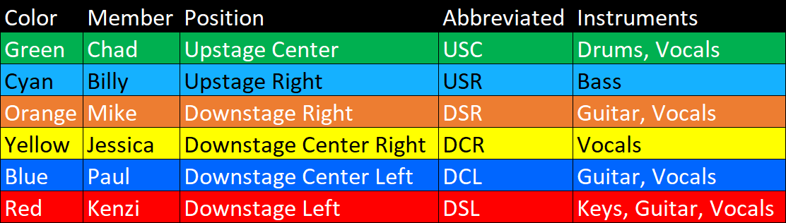
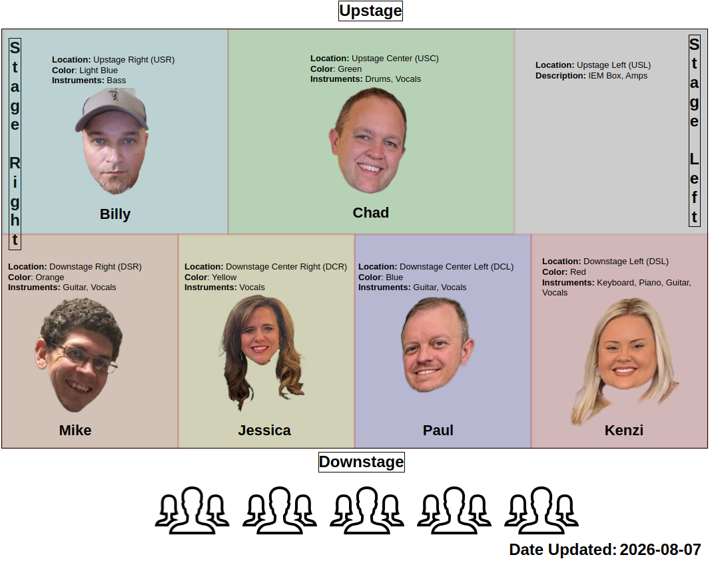
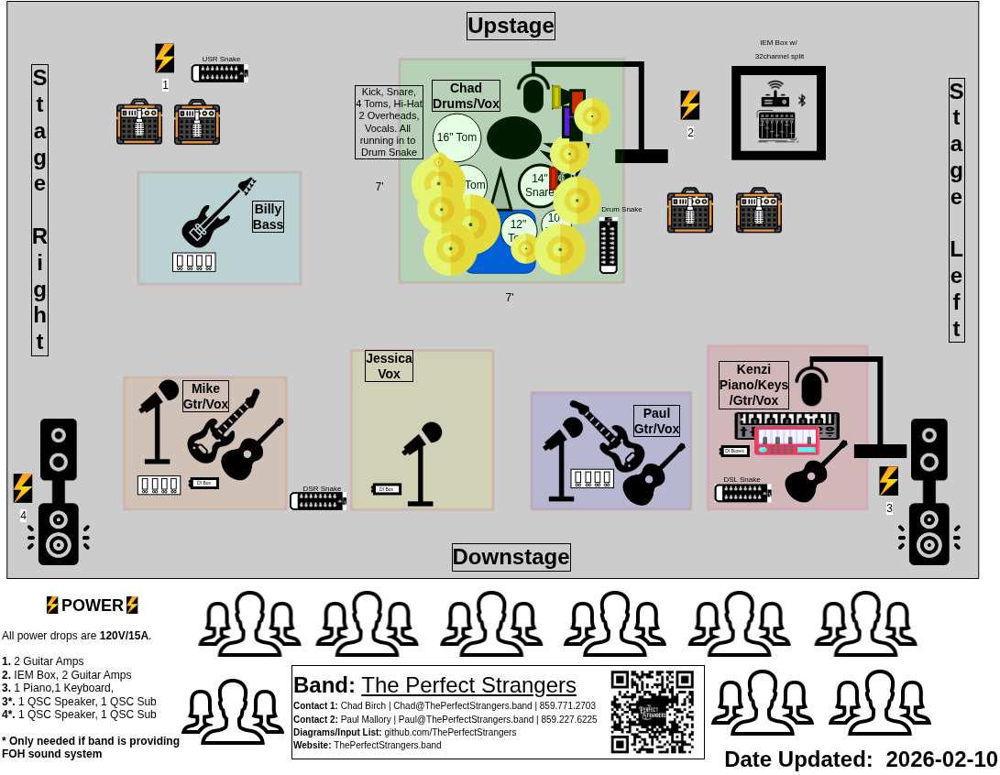

<table>
  <tr style="border: none;">
  <td float="left" style="border: none;">
    
  </td>
  <td float="right" style="border: none; text-align: center;">
    

      
    

    

      theperfectstrangers.band
    

      </td>
  </tr>
</table>

Rider Updated: {{LAST_UPDATED_DATE}}

<!-- title: The Perfect Strangers - Rider -->
# Rider

These are the requirements each venue that hosts the band must provide.

- [Rider](#rider)
  - [Contact Info](#contact-info)
  - [Personnel](#personnel)
    - [Band Members](#band-members)
      - [Input List/Split Map Convention](#input-listsplit-map-convention)
      - [Stage Diagram Convention](#stage-diagram-convention)
    - [Entourage](#entourage)
    - [Support Staff](#support-staff)
      - [Sound and lighting engineers](#sound-and-lighting-engineers)
      - [Equipment roadies](#equipment-roadies)
      - [Door/gate operators](#doorgate-operators)
  - [Equipment](#equipment)
    - [Stage area](#stage-area)
    - [Electrical](#electrical)
    - [Lighting](#lighting)
    - [Wi-Fi](#wi-fi)
  - [Parking](#parking)
    - [Band Member Vehicles](#band-member-vehicles)
    - [Equipment Trailer](#equipment-trailer)
  - [Cancellation Policy](#cancellation-policy)
- [Stage Diagram](#stage-diagram)
  - [Full Band](#full-band)
  - [Drums](#drums)
- [Input List](#input-list)
  - [Full Band](#full-band-1)
    - [Input + Equipment](#input--equipment)
    - [Split](#split)
      - [Modes](#modes)
      - [Splitter Assignments](#splitter-assignments)
        - [Order \& Ports](#order--ports)
        - [Snake Tails](#snake-tails)
    - [Mixer Configuration](#mixer-configuration)
  - [Acoustic](#acoustic)
    - [Input + Equipment](#input--equipment-1)

## Contact Info

You can reach out to the band by emailing [booking@theperfectstrangers.band](mailto:booking@theperfectstrangers.band). If you would like to speak with a member regarding a specific question, please provide your name and number so one of us can get back to you.

## Personnel

### Band Members

The documents and graphics in this repository use the following color convention for the band members:

#### Input List/Split Map Convention

#### Stage Diagram Convention

### Entourage

Each band member may have an additional person in their entourage (typically a significant other). In addition, the band may also employ up to 2 sound engineers/stagehands. These people should be allowed the same access as the band members and be exempt from being charged any admission or access fee to a venue.

### Support Staff

The band may employ support staff at a venue to help in the setup or operation of the light show. The staff includes, but it not limited to:

#### Sound and lighting engineers

Help setup the sound and lights before the performance and/or operate the equipment for the band during the performance.

#### Equipment roadies

Help load, setup, teardown, and pack equipment.

#### Door/gate operators

If an entry fee/cover charge is required, where the band gets 100% of the cover, the band will provide someone to take up the money. If the cover charge is being split with the venue, then the venue must also provide someone to observe the handling of the money. This helps to ensure everyone is satisfied that the money was handled properly at the end of the night. If the venue fails to provide someone, then they forfeit their rights to dispute anything regarding the handling of entry fee money.

If the venue is 21+ or has house rules to enforce (such as rules related to a liquor license), the venue must provide someone to ID individuals and enforce the house rules. Personnel provided by the band are only responsible for band related activities, such as taking up money at the door.

## Equipment

### Stage area

The band requires a dedicated stage area of at least 20' wide by 20' deep. This should be a dedicated area where through traffic is restricted. This is for the safety of the public, band member, and their equipment.

If a drum riser is to be used, it needs to be at least 10' wide by 10' deep. If the elevation of the rider is greater than 4 feet from the ground, a railing should be installed in the rear of the riser for safety.

### Electrical

The band will provide power conditioners and surge protectors for their equipment. We require the venue to provide enough dedicated breakers for our equipment to operate without issue.

  * PA Speakers
    * 2 x 15 amp breakers
      * One near Downstage Left.
      * One near Downstage Right.
    * If the venue is providing PA sound, then these are not required.
  * IEM box & Amps
    * 2 x 15 amp breakers
      * One new Upstage Right.
      * One new Upstage Left.
    * These are always required.

### Lighting

The band requires sufficient lighting for safe setup and teardown of equipment. Providing this lighting is the responsibility of the venue or promoter.

### Wi-Fi

If the venue has wi-fi that connects to the internet, the band should be provided with the connection info so they can connect their equipment to the wifi. This should be provided at no cost to the band. The band should be notified no later than 48 hours prior to the performance if the venue does not have wi-fi that connects to the internet.

## Parking

### Band Member Vehicles

The band may need as many as 6 parking spots for members and one extended space for the equipment truck and trailer, totaling 7 spaces. The equipment trailer must have reasonable proximity to the performing area and be able to accommodate the use of hand carts for transporting gear. If parking is limited at your venue, please contact the band ahead of time to get the exact number of parking spaces required for your show.

### Equipment Trailer

For a full band setup, the band uses a covered trailer to transport equipment. The trailer is approximately 9 feet tall (2.75  meters) and 6 feet wide (1.85 meters). This typically exceeds the height of most parking garages. Special parking accommodations close to the loading/unloading area must be made for the trailer if the venue/event utilizes a parking structure where the trailer will not meet the clearance requirements.

The trailer will need to have access close to the area designated for the band to load/unload equipment. This may require the use of parking cones to reserve the space until the band arrives. Please notify the band beforehand if any procedures need to be followed before the band's arrival.

## Cancellation Policy

The band reserves the right to cancel the performance for any reason regarding band member or equipment safety. Such reasons are, but not limited to:
  * Sickness of members  * Unstable or unsafe building or performance area
  * Volatile or threatening crowd
  * Excessive moisture in the air
  * Threat of severe rain or lightning
  * etc.

We hope never cancel a performance, but the safety of our band members is our number one priority, followed by the safety of our equipment.

# Stage Diagram

These are diagrams relating to the configuration and placement of people and/or equipment on stage.

## Full Band

This is the general layout of the band. It includes the people, microphones, equipment, cable routes, where power is needed, mixing equipment, and speaker placement.

**Note:** The band's `IEM Box` and `Bass` player may be mirrored if the stage access poses problems in the default configuration.

**Note:**  In a situation where the band is not in charge of the PA, the PA speakers located Downstage Right and Downstage Left should be omitted from consideration.

  
[Click here](../StageDiagram/FullBand/StageAssembly/README.md) to access the step-by-step stage assembly guide.

## Drums

For a detailed view of the drums, including microphones, tunings, and more, check out [Chad's Drum Repository](https://github.com/chadbirch/Drums).

# Input List

This is a list of inputs needed by the band. It includes:
  * The input description
  * Type of equipment (such as microphone)
  * If 48V Phantom Power is required
  * Other notes related to the input channel

More information regarding splitting the signal to front-of-house (FOH) can be found in the [Split section](#split).

## Full Band

### Input + Equipment

### Split

#### Modes

The band requires 32-channels of split capacity.

When splitting is required, we can support two modes:
1. (Preferred) The band uses their own microphones, running them into their IEM Mixer. Then a split signal is sent to the front-of-house (FOH). The band will manage all phantom power to mics and control all gain (staged to `-18.5 dbFS`). The band then manages their own IEM mixes, leaving the FOH engineer to only manage the FOH mix. This is preferred because it reduces the amount of time each band member must spend recalibrating their mix. The band can split the signal from their IEM Mixer box the following ways:

   1.  **AES50 via Ethercon**: A single Ethercon cable is sent from the **AES50 C** port of the band's Behringer WING Rack inside the IEM Mixer Box to the FOH mixing console. This allows the console to receive the audio signal, clock sync, and channel labels.
   2.  **XLR from two Midas DN4816-O Interfaces**: XLR cables are patched between the band's IEM Mixer Box and the FOH mixing console.

2. (Festival) All microphones and cabling are provided by a live sound team, who manage both FOH sound and individual mixing for each band member. The band would bring their own earbuds to connect to IEM body packs provided by the sound team. Alternatively, the band may provide IEM transmitters and body packs if needed, but they will need to be routed from the monitor mixing board on-stage.

#### Splitter Assignments

All ports are XLR male.

##### Order & Ports

The splitter ports are ordered as follows:
1. **Drums**: 1-10
2. **Bass**: 13
3. **Piano/Keyboards**: 15-16
4. **Guitars**: 17-22
    * (E): Electric
    * (A): Acoustic
6. **Vocals**: 25-30
    * `Vocals 6` may not be required for every show as it is for guest vocalists.

##### Snake Tails

A 10 ft. snake cable may be utilized from the IEM Mixer to handle connections at a distance. There are four 8-channel snake cables that are color sequenced by banding on the cable: Green, Blue, Red, and Yellow. The `Split Map` is broken down into four groups containing eight channels across three distinct rows. The top row if the group specifies the banded cable to use. The second row identifies the color sequence for the non-labeled connecting end of the snake cable which should be color-matched to the numbered port assignment. Finally, the third row specifies the generic input description by location, matching the performer using the [Document Style](#document-style) outlined at the beginning. Meaning you find the cable banded in green, the plug each non-labeled end to the port corresponding to the color of the cable, then the labled end can connect to the patch routed to the front-of-house (FOH) engineer.

**Note:** All outputs are set as [Line-Level](https://drewbrashler.com/2026/behringer-wing-stageconnect-guide/) from the band's mixer. You can find out more details regarding the split labels on the Split Map:

### Mixer Configuration

The band uses a Behringer WING RACK mixer for mixing all IEMs and front-of-house when necessary. If you will be working with the band to manage live sound at an event using their equipment, you can download the latest configuration from the [Mixer folder](Mixer).

You can view the mixer configuration by using the WING EDIT software provided by Behringer. You can [download it from their website](https://www.behringer.com/wing/wing-rack#documentations).

## Acoustic

The band can perform in smaller venues with an acoustic set up. This setup replaces the full drum set with a smaller percussion setup, removes the need for IEMs and the IEM box, and shrinks the overall stage footprint. This configuration differs per show as it aligns more closely with the set list. For any documentation or requirements, please contact the band directly at [technical@theperfectstrangers.band](mailto:technical@theperfectstrangers.band?subject=Acoustic%20Set%20Up%20for%20The%20Perfect%20Strangers).

### Input + Equipment

