

  

# Stage Load-In Order

This document outlines the recommended load-in sequence for The Perfect Strangers full band setup. Following this order ensures efficient setup and minimizes the need to move equipment once placed.

You can download the entire Stage Load-In Order guide here:

## Overview

The stage setup is completed in 11 sequential steps, building from the foundation (background and rugs) to the final placement of instruments. Each step represents a layer in the stage diagram and corresponds to a specific phase of the load-in process.

---

## Step 1: Boundaries & Orientation

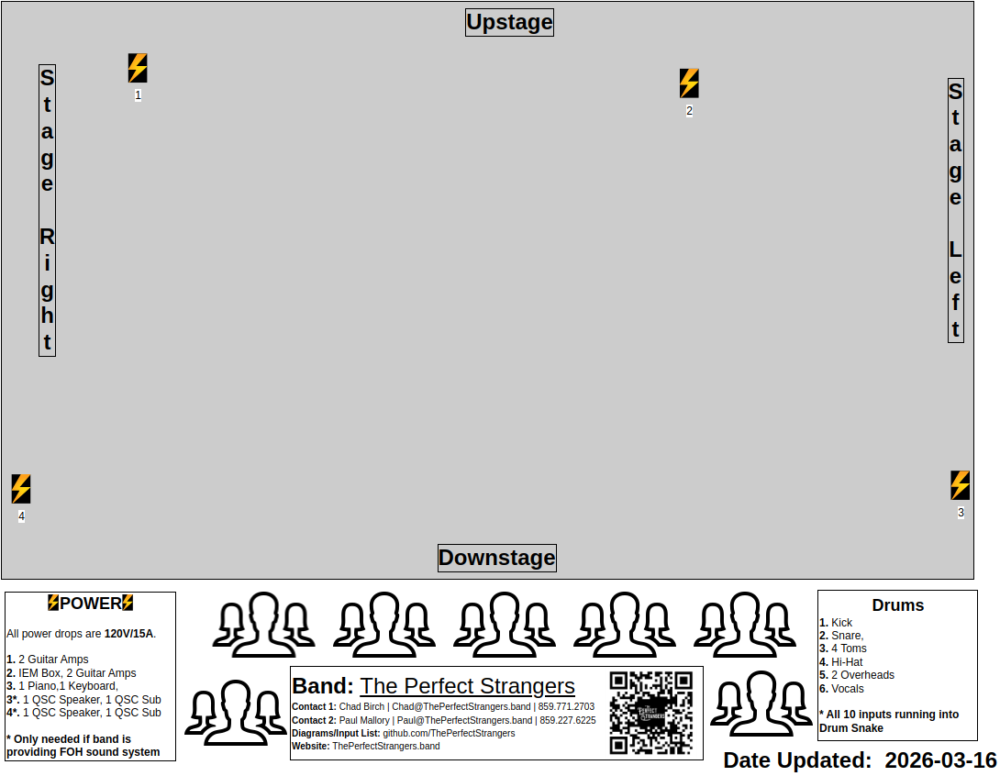

Establish the stage boundaries and orientation. Mark the downstage edge and identify stage left/right positions. This provides the reference frame for all subsequent positioning.

---

## Step 2: Drum Rug

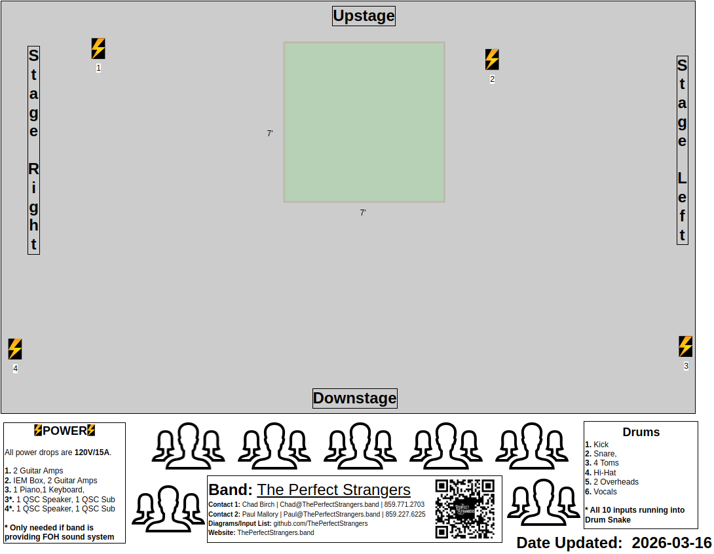

Place the drum rug first as it anchors the entire setup. Position it according to stage markings to ensure proper alignment of the drum kit and surrounding equipment.

---

## Step 3: Other Rugs

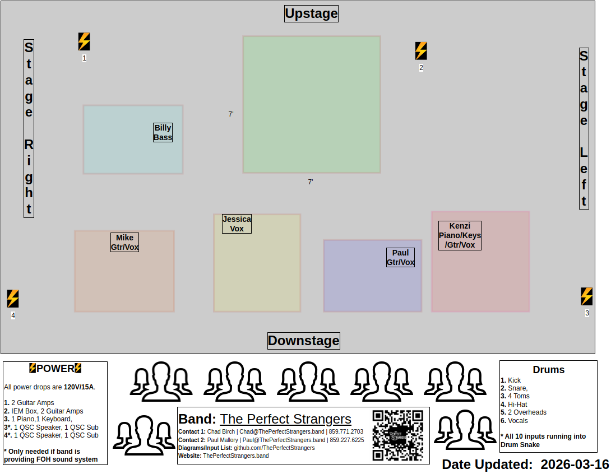

Position additional rugs for other performers. These define the playing areas and help with cable management throughout the set.

---

## Step 4: Speakers

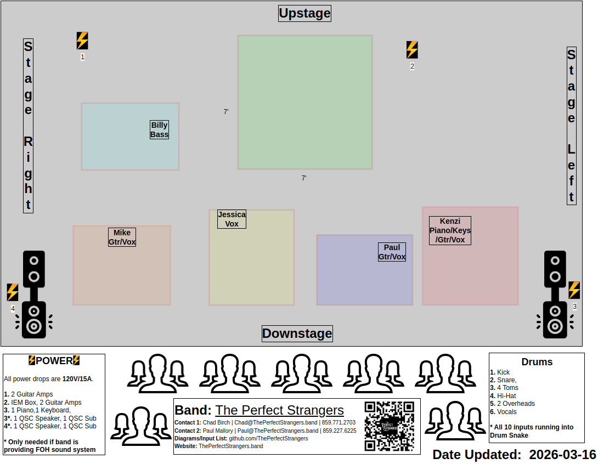

Place amplifiers and subwoofers. Position speakers before running cables to ensure optimal sound coverage and to avoid repositioning after cables are laid.

---

## Step 5: IEM Box + Amps

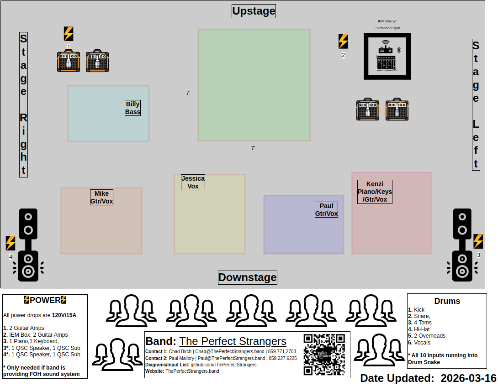

Set up the in-ear monitor (IEM) distribution system and guitar/bass amplifiers. This central hub should be positioned for easy access during soundcheck and performance.

---

## Step 6: Drums

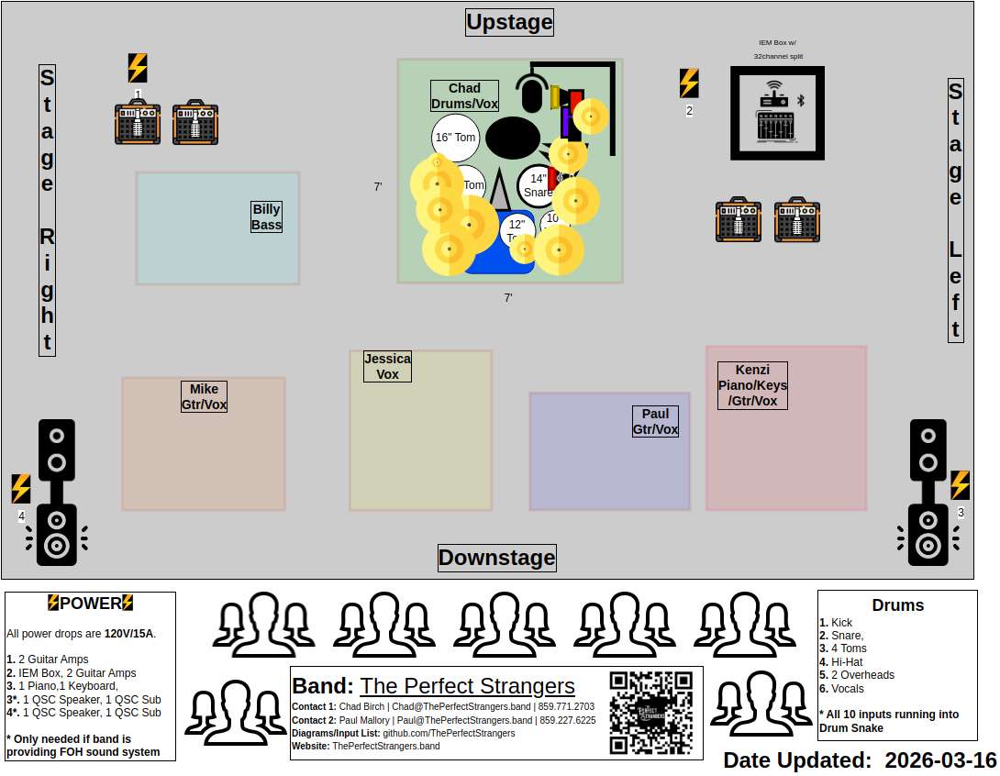

Assemble and position the drum kit on the drum rug. Complete the full kit setup including hardware, cymbals, and drums before moving to other stages.

---

## Step 7: Mic Stands

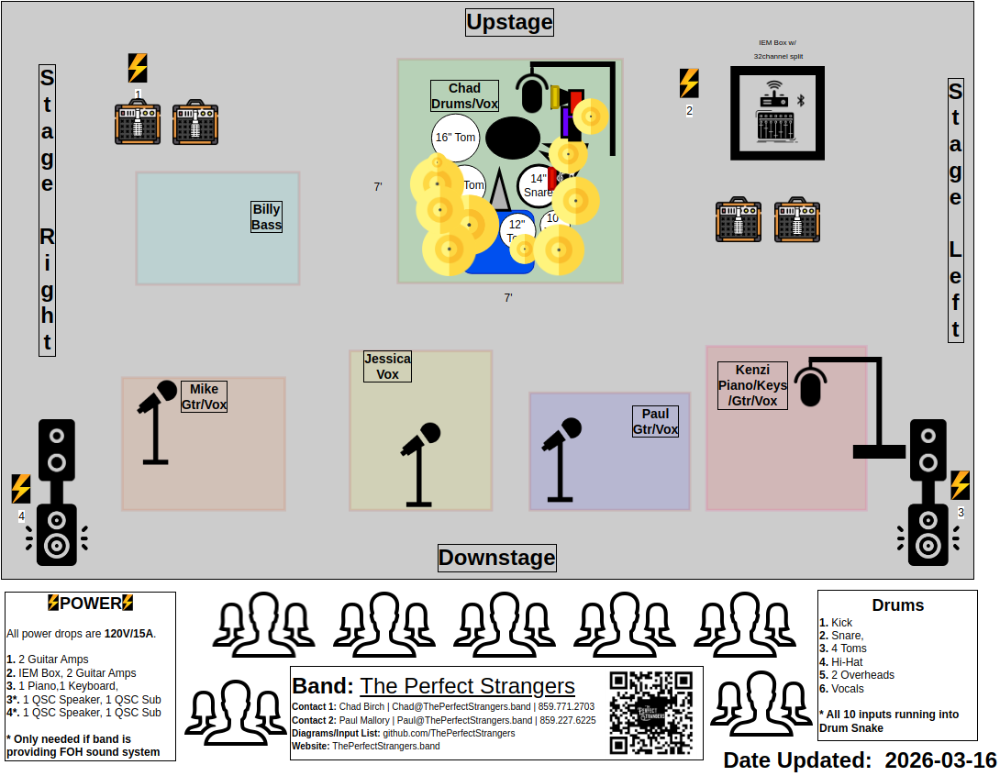

Position all microphone stands according to the stage plot. Set approximate heights and angles to expedite soundcheck.

---

## Step 8: Keyboards + Pedals + DIs

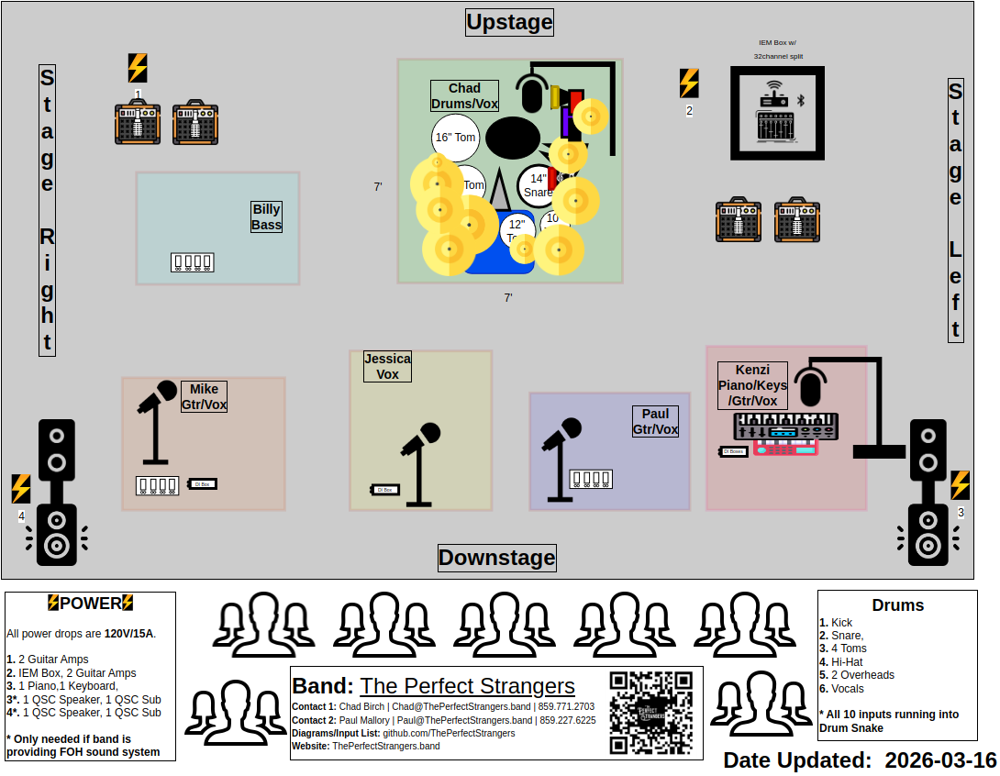

Set up keyboard stands, place keyboards, and position associated pedals and DI boxes. Arrange pedals within comfortable reach of the keyboard player.

---

## Step 9: Cable Ramps

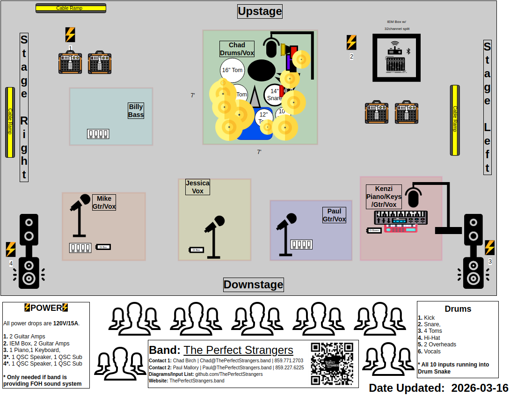

Install cable ramps at crossing points to protect cables and prevent tripping hazards. Place ramps before running final instrument cables.

---

## Step 10: Snakes 

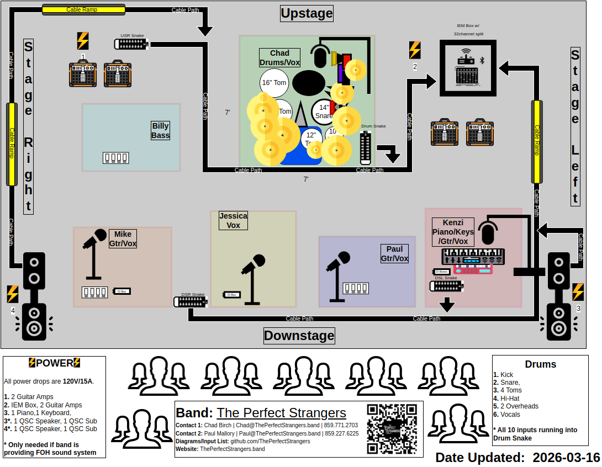

Run stage snakes from the mixing position to the stage. Route cables along designated paths, keeping them clear of performer positions where possible. Run all remaining cables including instrument cables, power cables, and monitor sends. Secure cables with appropriate strain relief and routing to minimize stage clutter.

---

## Step 11: Guitars

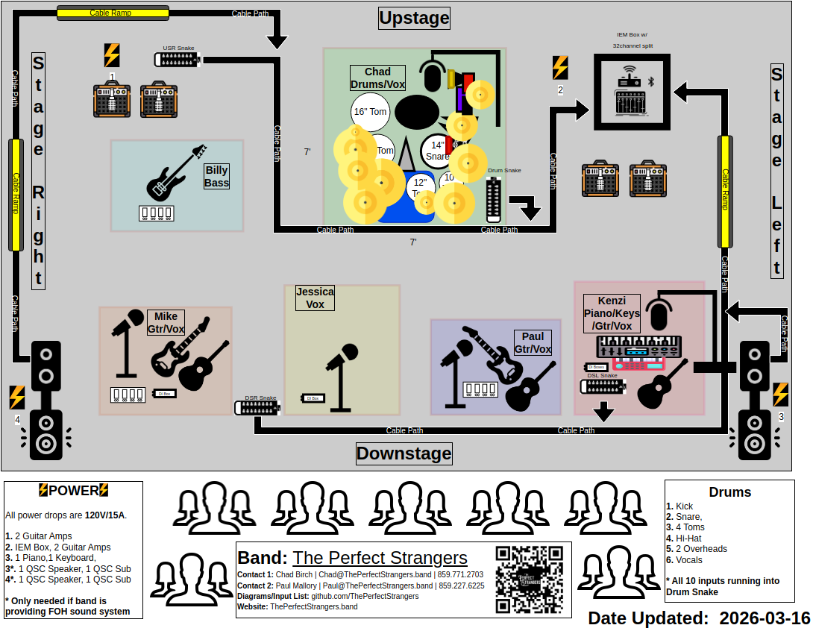

Place guitar stands and position guitars in their designated locations. This is the final step as guitars are often the last items set up before soundcheck begins.

---

## Notes

- Always verify power requirements before connecting amplifiers and active equipment
- Keep a clear path to stage exits for safety
- Refer to the [Full Band Input List](../../../InputList/FullBand/) for specific microphone and DI requirements
- Consult the [Technical Rider](../../../Rider/Rider.md) for detailed specifications and requirements
