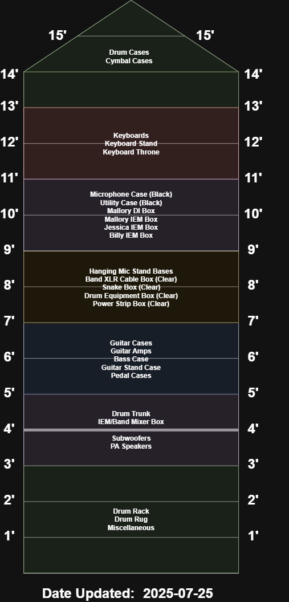

<!-- title: The Perfect Strangers - Technical Documentation -->
# Trailer Load Map <!-- omit from toc -->

The trailer load map for [The Perfect Strangers](https://ThePerfectStrangers.band).

- [Complete Technical Documentation](#complete-technical-documentation)

# Overview

The key concept of the trailer load map is to enable the band to unpack things from the trailer in the order they will be deployed on stage. This should start with fixture pieces, like the drum rug & rack, IEM box, and keyboard stands. It should then move down amps, pedal cases, and mic stands. Once the fixture componets are in place, then they can start being set up. This should decrease the time the band has to spend loading and unloading as well as make the overall footprint of the band smaller during these times.

# Map

